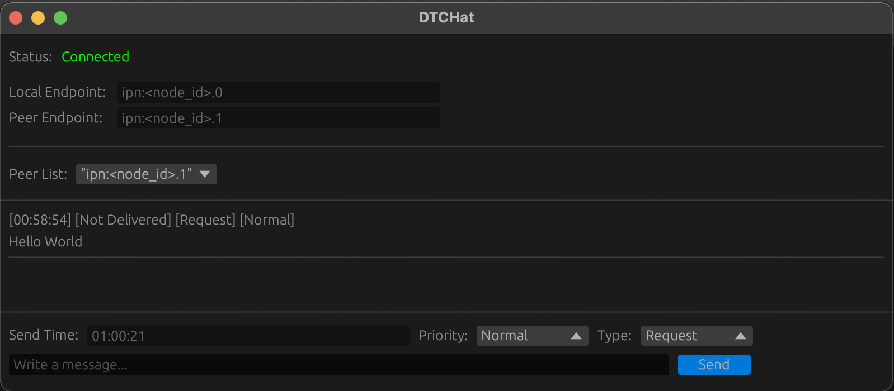

# DTChat



DTChat is a chat application designed to facilitate communication between peers using DTN (Delay Tolerant Networking) protocols. It is built using the Rust programming language.

## Getting Started

### Prerequisites

Ensure you have the following installed:
- Rust and Cargo: [Install Rust](https://www.rust-lang.org/tools/install)

### Running the Project

You can run the project in two ways: using `cargo watch` for live reloading during development, or in the classic mode.

#### Using `cargo watch`

`cargo watch` automatically rebuilds and runs the project whenever you make changes to the source code. This is useful for development.

1. Install `cargo watch` if you haven't already:

```sh
cargo install cargo-watch
```
2. Run the project using `cargo watch`:

```sh
cargo watch -x 'run -- -release
```

### Peer configuration

The application expects a `peer-config.yaml` file at the root of the project. This file contains the configuration for the peer endpoints.
